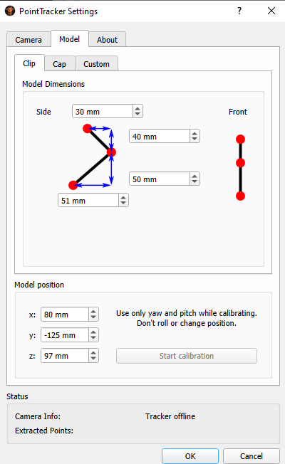

# FlisherOpenTrackStuff
FlisherOpenTrackStuff

Voici mon guide pour l'utilisation d'[OpenTrack](https://github.com/opentrack/opentrack/).

## Étape 1: Téléchargement des pilotes pour la Webcam PS3 Eye
Télécharger la dernière version des pilotes: https://github.com/jkevin/PS3EyeDirectShow/releases/tag/1.0b2
Exécuter le fichier pour installer les pilotes

## Étape #2: Téléchargement d'OpenTrack
Télécharger la dernières version d'Opentrack disponible sur la page https://github.com/opentrack/opentrack/releases

Le lien direct pour la dernière version au momment d'écrire ces lignes: [OpenTrack 2.3.12](https://github.com/opentrack/opentrack/releases/download/opentrack-2.3.12/opentrack-2.3.12-win32-setup.exe)

Exécuter le fichier pour installer OpenTrack.

## Étape #3: Brancher la WebCam
Vous devrier voir que votre ordinateur détecte un nouveau périphériques après quelques secondes.

## Étape #4: Lancer Opentrack
Lancer Opentrack

## Étape #5: Validation de fonctionalité
Lors du lancement initial, les options suivantes devraient normalement être sélectionnées

* Cliquez le petit Marteau a droite de PointTracker
* Sélectionnez "PS3 eye open driver" 
* Fermer le menu en appyant sur "OK: en bas
* Lancer le test en appuyant sur "Start", vous deviez voir une image noir floues ou nette.

## Étape #6: Configuration de la webcam
La webcam de PS3 a 2 niveaux de focus configurable en tournant la lentille.  

Pour la grande majorité des gens, le mode en tournant dans le sens contraire des aiguilles d'une montre est le plus efficace.

## Étape 7: Configuration du modèle de la clip
* Assurez-vous d'avoir des batterie rechargeable NiCd, 1.2v.
* Mettez la switch à On. (vous devriez voir vois 3 points)
* Démarrer le tracking en appuyant sur "Start"
* Cliquez le petit Marteau a droite de PointTracker
* Choisissez l'onglet "Model"
* Choisissez le sous-onglet "Clip"
* Configurer les valeurs suivantes si le long bras est vers le bas (ou le contraire si le long bras est vers le haut)

* Démarrez la calibration en cliquant sur "Start Calibration"
* Effectuez des mouvements de gauche à droite et de haut en pas quelques fois.  NE PAS pencher ou déplacer votre tête.
* Terminer la calibration en cliquand sur "Stop Calibration"

Binding.png

## Troubleshooting:
### Effet de Flares

Si vous avez des flares, vous pouvez réduire le "gain" de la webcam en retournant dans "PointTrackers Settings, et cliquer "Open" dans les options de caméras.
Exemple:

* Selon votre environnement et distance de la webcam, le gain et l'exposure sont 2 options à ajuster.
* SVP ajuster la taille des pixel avec de la marge de manoeuvre.  Notez que les valeur de 2 a 12 sont généralement bonnes, le minimum pourrait être légèrement plus haut si vous avez des points qui aparaissent comme sur la photos des flares.

### Les axes semblent mélangés dans OpenTrack: 
Vous avez probablement mal configué les mesures, ou installé la clip à l'envers
